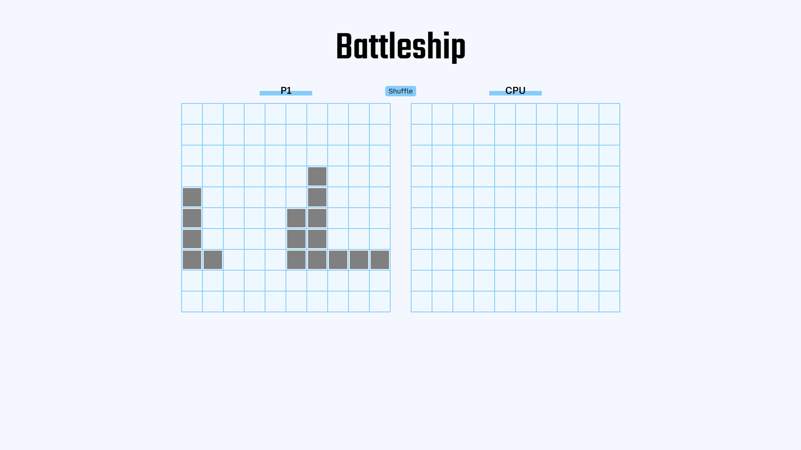

# Battleship

Battleship is a browser-based implementation of the classic strategy game, built with JavaScript. The project focuses on applying modular JavaScript, DOM manipulation, and game logic to create an interactive experience where players compete against a computer to sink each other's ships.

## Features

- Place ships randomly on a grid
- Turn-based gameplay against a computer opponent
- Visual feedback for hits, misses
- Modular code structure for maintainability

#### Future
- Custom ship placemet
- 2-player version
- Polished computer intelligence

## Preview

[Live Preview](https://vicker14.github.io/battleship/)
